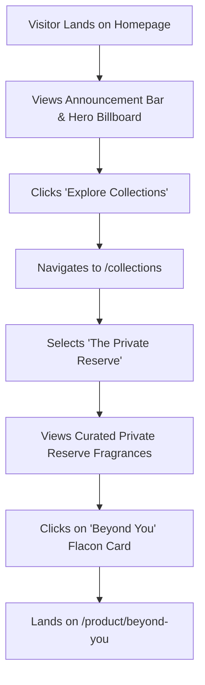
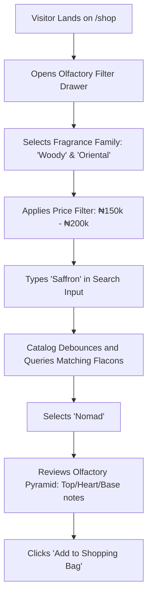
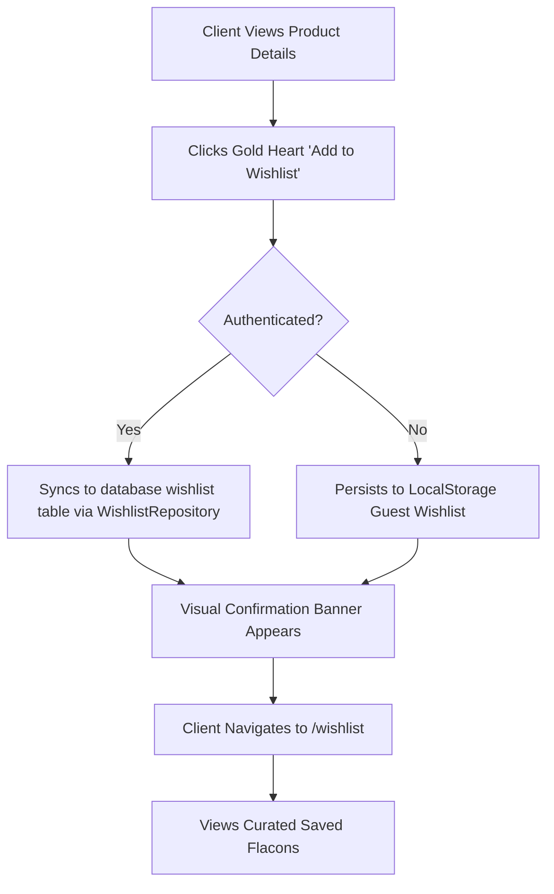

# Phase 4 Implementation Plan & Architecture Contract

**Phase Title**: Storefront, Haute Parfumerie Catalog & Visual CMS Browsing  
**Author**: Lead Systems Architect & Senior Full Stack Engineer  
**Status**: Formal Planning & Contract Specification (No Implementation)  
**Target Release Tag**: `v0.4.0-phase-4`

---

## 1. Phase Scope

### 1.1 In Scope
- **Storefront Homepage (`/`)**:
  - Dynamic CMS-driven Announcement Bar
  - Editorial Hero Billboard with call-to-action routing
  - Curated Olfactory Collections Showcase
  - Featured Signature Extraits Grid
  - Artisanal Brand Story & Sourcing Philosophy
  - Client Testimonials & Star Ratings Carousel
  - Newsletter Privilege Subscription
  - Boutique Footer with Operating Info & Concierge Links
- **Haute Catalog & Shop (`/shop`)**:
  - Multi-faceted filtering: Fragrance Family (Woody, Oriental, Floral, Fresh, Gourmand, Chypre), Formulation Concentration, Price Range slider/brackets, In-Stock only.
  - Sorting: Price (Low to High, High to Low), Bestseller, New Arrivals, Customer Rating, Alphabetical.
  - Live search with instant debounced keyword matching against fragrance name, notes, and SKU.
  - Dual presentation modes: Responsive 2-column mobile, 3-column tablet, 4-column desktop luxury grid.
  - Pagination / Infinite Scrolling with smooth scroll anchor restoration.
  - Luxury Product Flacon Card with hover image reveal, olfactory family tag, and quick-add / wishlist interaction.
- **Boutique Collections (`/collections`)**:
  - Collection portfolio directory (*The Private Reserve*, *The Oud Edition*, *Signature Classics*, *Discovery Portfolios*).
  - Dedicated collection view: Banner, editorial narrative, and filtered product listing.
- **Product Details Page (`/product/:slug`)**:
  - High-resolution multi-angle image gallery with zoom and fullscreen inspection modal.
  - Dynamic Olfactory Pyramid component visually mapping Top Notes, Middle/Heart Notes, and Base Notes.
  - Concentration, Volume (100ml / 50ml), and Longevity disclosures.
  - Artisanal formulation ingredients and Master Parfumeur application guide.
  - Stock availability indicator (In Stock, Low Stock, Allocation Reserved).
  - Add to Shopping Bag interaction (persisted to local state via CartProvider).
  - Wishlist toggle with optimistic UI feedback.
  - Related Fragrance Recommendations based on shared fragrance family and note profiles.
  - Verified Customer Olfactory Reviews with star breakdowns and moderation gating.
- **Client Wishlist (`/wishlist`)**:
  - Saved luxury extraits list with move-to-cart action, removal action, and shareable link.
- **States & UX**:
  - Luxury branded skeleton loaders for every section.
  - Empty states (*"No fragrances match your olfactory search"*).
  - Graceful error boundaries and retry triggers.

### 1.2 Explicitly Out of Scope
- **Checkout Processing**: Payment gateway integration, shipping rate calculation at checkout, and order placement (deferred strictly to Phase 5).
- **Payment Gateways**: Paystack, Flutterwave, and Direct Bank Transfer webhooks (Phase 5).
- **Customer Account Management**: Address book editing, past order history inspection, and profile mutation (Phase 6).
- **Admin Dashboard CRUD**: Creating/editing products, updating CMS content, and managing orders via the admin cockpit (Phase 7 & 8).
- **Inventory Concurrency Mutations**: Permanent inventory decrements on stock tables (Phase 5).

---

## 2. User Journeys

### Journey 1: Olfactory Discovery & Collection Navigation


### Journey 2: Filtered Catalog Search & Note Inspection


### Journey 3: Wishlist Preservation & Return Visit


---

## 3. Component Inventory

| Component Name | Feature Owner | Purpose | Props | State | Dependencies | Reusable |
| :--- | :--- | :--- | :--- | :--- | :--- | :---: |
| `HeroBillboard` | `features/home` | Editorial hero section with CMS image & CTAs | `banner: CmsHeroBanner` | None | `Button`, `FramerMotion` | No |
| `AnnouncementBar` | `components/common` | Top ribbon for delivery & privilege announcements | `data: CmsAnnouncement` | Dismissed flag | `Lucide-react` | Yes |
| `CollectionsShowcase`| `features/home` | Grid of curated fragrance collections | `collections: Collection[]` | Hovered index | `CollectionCard` | No |
| `ProductGrid` | `features/shop` | Responsive multi-column layout for flacons | `products: Product[]`, `isLoading: boolean` | None | `ProductCard`, `Skeleton` | Yes |
| `ProductCard` | `features/shop` | Luxury flacon card with notes tag and quick action | `product: Product`, `priority?: boolean` | Image hovered | `Money`, `useWishlist` | Yes |
| `ProductFilterDrawer`| `features/shop` | Mobile/Desktop slide-out filter panel | `filters: ShopFilters`, `onChange: Function` | Selected tags | `Slider`, `Checkbox` | Yes |
| `ProductSortDropdown`| `features/shop` | Order selection (Price, Rating, Newest) | `value: SortOption`, `onChange: Function` | Open/Close | `Radix Dropdown` | Yes |
| `SearchBar` | `features/shop` | Debounced catalog search input | `query: string`, `onSearch: Function` | Input value | `useDebounce`, `Input` | Yes |
| `OlfactoryPyramid` | `features/product` | Interactive visualizer for Top/Heart/Base notes | `notes: FragranceNotesVO` | Active layer | `FramerMotion` | Yes |
| `ProductGallery` | `features/product` | Multi-angle flacon viewer with zoom | `images: ProductImage[]` | Active index, zoom | `Modal` | Yes |
| `ProductMetaAccordion`| `features/product`| Collapsible details: Ingredients, Application | `ingredients: string`, `howToUse: string` | Expanded items | `Radix Accordion` | Yes |
| `ReviewsSummary` | `features/product` | Rating score, star distribution & review count | `rating: number`, `reviewsCount: number` | None | `StarRating` | Yes |
| `ReviewsList` | `features/product` | Verified patron testimonials stream | `reviews: Review[]` | Page index | `ReviewCard` | Yes |
| `RelatedProducts` | `features/product` | Recommendation carousel based on note profile | `currentProductId: string`, `family: string` | None | `ProductCard` | Yes |
| `WishlistButton` | `features/wishlist`| One-click toggle heart button | `productId: string`, `className?: string` | Optimistic status | `useWishlist` | Yes |

---

## 4. Repository Contracts

### 4.1 `IProductRepository`
```typescript
export interface ProductQueryFilters {
  categorySlug?: string;
  collectionSlug?: string;
  fragranceFamily?: FragranceFamily[];
  minPrice?: number;
  maxPrice?: number;
  inStockOnly?: boolean;
  searchQuery?: string;
  sortBy?: 'price_asc' | 'price_desc' | 'newest' | 'bestseller' | 'rating';
  page?: number;
  pageSize?: number;
}

export interface PaginatedProductsResult {
  items: Product[];
  totalCount: number;
  currentPage: number;
  totalPages: number;
  hasNextPage: boolean;
}

export interface IProductRepository {
  getProducts(filters: ProductQueryFilters): Promise<PaginatedProductsResult>;
  getProductBySlug(slug: string): Promise<Product | null>;
  getProductById(id: string): Promise<Product | null>;
  getFeaturedProducts(limit?: number): Promise<Product[]>;
  getBestsellers(limit?: number): Promise<Product[]>;
  getRelatedProducts(productId: string, fragranceFamily: FragranceFamily, limit?: number): Promise<Product[]>;
  searchProducts(query: string, limit?: number): Promise<Product[]>;
}
```

### 4.2 `ICategoryRepository` & `ICollectionRepository`
```typescript
export interface ICategoryRepository {
  getActiveCategories(): Promise<Category[]>;
  getCategoryBySlug(slug: string): Promise<Category | null>;
}

export interface ICollectionRepository {
  getActiveCollections(): Promise<Collection[]>;
  getFeaturedCollections(): Promise<Collection[]>;
  getCollectionBySlug(slug: string): Promise<Collection | null>;
}
```

### 4.3 `ICMSRepository`
```typescript
export interface ICMSRepository {
  getSectionContent<T = Record<string, unknown>>(sectionKey: string): Promise<T | null>;
  getAllPublishedSections(): Promise<Record<string, unknown>>;
  getSiteSettings(): Promise<Record<string, unknown>>;
}
```

### 4.4 `IWishlistRepository`
```typescript
export interface IWishlistRepository {
  getWishlistProductIds(customerId: string): Promise<string[]>;
  getWishlistProducts(customerId: string): Promise<Product[]>;
  addToWishlist(customerId: string, productId: string): Promise<void>;
  removeFromWishlist(customerId: string, productId: string): Promise<void>;
}
```

---

## 5. Service Contracts

### 5.1 `ProductService`
- **Responsibilities**:
  - Validates query filters, sanitizes search terms, and applies pagination bounds.
  - Transforms database records into `ProductEntity` domain instances with `Money` and `FragranceNotes` Value Objects.
  - Fallback logic: If database search yields zero matches, suggests alternate olfactory family candidates.
  - Guarantees sorting algorithms strictly respect sale prices when present.

### 5.2 `CollectionService`
- **Responsibilities**:
  - Resolves collection slugs into structured domain objects.
  - Combines collection metadata with corresponding catalog items for the collections landing page.

### 5.3 `CMSService`
- **Responsibilities**:
  - Provides strongly-typed JSON schema validation (via Zod) on raw database JSONB payloads for hero banners, brand story, and announcements.
  - Provides immutable fallback defaults if a CMS section is draft or temporarily missing in the database, preventing storefront blank screens.

### 5.4 `WishlistService`
- **Responsibilities**:
  - Syncs guest local storage wishlist with database upon customer authentication.
  - Emits domain events (`WishlistUpdated`) for analytics and client telemetry.

---

## 6. Hook Contracts

| Hook | Parameters | Returns | Usage |
| :--- | :--- | :--- | :--- |
| `useProducts(filters)` | `ProductQueryFilters` | `{ products, totalCount, totalPages, isLoading, error, refetch }` | Catalog browse & filter grid |
| `useProduct(slug)` | `slug: string` | `{ product, isLoading, error, isNotFound }` | Product Details Page |
| `useFeaturedProducts(limit?)` | `limit?: number` | `{ products, isLoading, error }` | Homepage featured flacons |
| `useCollections()` | None | `{ collections, isLoading, error }` | Collections directory |
| `useCollection(slug)` | `slug: string` | `{ collection, products, isLoading, error }` | Collection detail page |
| `useCMS(sectionKey)` | `sectionKey: string` | `{ content, isFallback, isLoading }` | Visual CMS sections |
| `useWishlist()` | None | `{ items, isInWishlist, toggleWishlist, count, isLoading }` | Wishlist buttons & badge |
| `useProductSearch(query)` | `query: string` | `{ results, isSearching, clear }` | Debounced header search modal |

---

## 7. React Query Strategy

| Query Key | Cache `staleTime` | Cache `gcTime` | Retry Policy | Invalidation Triggers |
| :--- | :---: | :---: | :---: | :--- |
| `['products', filters]` | **5 Minutes** | **15 Minutes** | 2 Retries | Admin product mutation, inventory change |
| `['product', slug]` | **10 Minutes** | **30 Minutes** | 2 Retries | Review submitted, product updated |
| `['featured-products']` | **10 Minutes** | **30 Minutes** | 3 Retries | Admin catalog re-order |
| `['collections']` | **15 Minutes** | **60 Minutes** | 2 Retries | Admin collection mutation |
| `['cms', sectionKey]` | **15 Minutes** | **60 Minutes** | 3 Retries | CMS publish event |
| `['wishlist', customerId]` | **0 Seconds** | **5 Minutes** | 1 Retry | `addToWishlist`, `removeFromWishlist` (Optimistic update) |

---

## 8. CMS Schema & Section Contracts

### 8.1 Homepage Hero (`key = 'homepage_hero'`)
```typescript
export interface CmsHeroContent {
  badge: string;              // e.g. "The Private Reserve Collection"
  headline: string;           // e.g. "Transcendence in Every Note"
  subtitle: string;           // e.g. "Handcrafted extraits de parfum born from the rarest distillations."
  primaryCtaText: string;     // e.g. "Explore Creations"
  primaryCtaUrl: string;      // e.g. "/shop"
  secondaryCtaText: string;   // e.g. "View Collections"
  secondaryCtaUrl: string;    // e.g. "/collections"
  backgroundImage: string;    // High-resolution WebP URL
}
```

### 8.2 Top Announcement Bar (`key = 'announcement_bar'`)
```typescript
export interface CmsAnnouncementContent {
  enabled: boolean;
  text: string;               // e.g. "COMPLIMENTARY NATIONWIDE DELIVERY OVER ₦150,000"
  linkText?: string;          // e.g. "EXPLORE CREATIONS"
  linkUrl?: string;           // e.g. "/shop"
}
```

### 8.3 Brand Heritage & Story (`key = 'brand_story'`)
```typescript
export interface CmsStoryContent {
  title: string;              // "The Art of Philz Signature"
  quote: string;              // "Perfume is an invisible crown of memory and presence."
  philosophy: string;         // Editorial brand narrative
  sourcing: string;           // Distillation and botanical origin statement
  image1Url?: string;         // Atelier flacon render
  image2Url?: string;         // Botanical distillation imagery
}
```

### 8.4 Fallback Safety Protocol
Every CMS hook implements the **Defensive Fallback Pattern**: if the query returns null or network fails, the hook provides pre-compiled luxury default content immediately, preventing flash-of-unstyled-content or layout collapse.

---

## 9. API & Data Requirements by Page

```
Homepage (/)
├── CMS Announcement Bar -> cms_content (key: 'announcement_bar')
├── CMS Hero Billboard   -> cms_content (key: 'homepage_hero')
├── Curated Collections  -> collections (is_featured: true, limit: 3)
├── Featured Extraits    -> products (is_featured: true, status: 'published', limit: 4)
├── Brand Narrative      -> cms_content (key: 'brand_story')
├── Client Reviews       -> reviews (status: 'featured', limit: 6)
└── Site Settings        -> site_settings (keys: 'store_name', 'currency_symbol', 'contact_email')

Shop (/shop)
├── Categories Filter    -> categories (is_active: true)
├── Collections Filter   -> collections (is_active: true)
├── Filtered Products    -> products (status: 'published' + active filters)
└── Total Count          -> products (count: exact)

Collections (/collections & /collections/:slug)
├── Collections List     -> collections (is_active: true)
└── Collection Flacons   -> products (collection_id: matchedId)

Product Details (/product/:slug)
├── Product Entity       -> products (slug: matchedSlug)
├── Flacon Imagery       -> product_images (product_id: matchedId, order by display_order)
├── Video Reel (opt)     -> product_videos (product_id: matchedId)
├── Olfactory Notes      -> products (top_notes, middle_notes, base_notes)
├── Customer Reviews     -> reviews (product_id: matchedId, status: 'approved')
└── Related Flacons      -> products (fragrance_family: matchedFamily, exclude currentId, limit: 4)

Wishlist (/wishlist)
└── Wishlist Items       -> wishlist JOIN products ON product_id
```

---

## 10. Performance Plan

1. **Route Code Splitting**: Maintained via `React.lazy()` with route chunks staying under 15 kB.
2. **Image Optimization Protocol**:
   - Flacon imagery delivered with explicit `aspect-ratio` to avoid Cumulative Layout Shift (CLS).
   - `loading="lazy"` on below-the-fold catalog cards; `loading="eager"` on hero billboard with `fetchpriority="high"`.
   - Responsive `srcset` providing thumbnail, card, and zoom resolutions.
3. **Prefetch Strategy**:
   - Hovering over a `ProductCard` triggers TanStack Query `queryClient.prefetchQuery(['product', slug])` for instant page transition.
4. **List Virtualization Readiness**:
   - Pagination by default (12 items per page). Infinite scroll option utilizes TanStack Virtual if catalog exceeds 100 products.

---

## 11. Accessibility Plan (WCAG 2.1 AA Compliance)

1. **Keyboard Navigation**:
   - Filter drawer, search dialog, and gallery modals must trap focus properly using Radix UI primitives.
   - All interactive elements must exhibit visible `:focus-visible` gold rings (`focus-visible:ring-2 focus-visible:ring-luxury-gold`).
2. **Screen Reader Semantic Hierarchy**:
   - Exactly one `<h1>` per view.
   - Descriptive `aria-label` attributes on icon-only buttons (Wishlist heart, Cart bag, Search trigger, Filter toggle).
3. **Contrast Verification**:
   - All text tokens satisfy WCAG AA contrast (minimum 4.5:1 for body copy on `#0A0A0A` background; Champagne Gold `#D4AF37` tested at 5.2:1 against Obsidian Black).
4. **Motion Sensitivity**:
   - Wrap Framer Motion animations inside `@media (prefers-reduced-motion: reduce)` fallbacks.

---

## 12. Search Engine Optimization (SEO) Plan

1. **Dynamic Metadata**:
   - Title template: `%s | PHILZ SIGNATURE Haute Parfumerie`.
   - Meta description populated from `product.meta_description` or dynamic product summary.
2. **Open Graph & Twitter Cards**:
   - `og:image`: Primary flacon photography URL.
   - `og:type`: `product`.
   - Product availability and price tags in Open Graph format.
3. **Structured Data (JSON-LD)**:
   - Schema.org `Product` markup injected into `<head>`:
     - `name`, `image`, `description`, `sku`, `brand` (`PHILZ SIGNATURE`).
     - `offers`: `priceCurrency` (`NGN`), `price`, `availability` (`InStock`).
     - `aggregateRating`: rating score and review count.
4. **Canonical URLs**:
   - Self-referencing canonical tags on `/shop`, `/collections`, and `/product/:slug` preventing duplicate parameter indexing.

---

## 13. Testing Strategy

1. **Unit Tests**:
   - Value Objects: `Money` calculation and currency formatting (NGN ₦).
   - `FragranceNotes`: Array decomposition into pyramid tiers.
   - `ProductService`: Query filter builder and sorting sanitization.
2. **Integration Tests**:
   - `ProductRepository`: PostgREST query generation, pagination count, and error translation.
   - `CMSService`: Fallback delivery when database records are absent.
3. **UI & Responsive Tests**:
   - 375px (Mobile Portrait - iPhone SE), 768px (Tablet - iPad), 1280px (Desktop), 1920px (Ultra-wide).
   - Filter drawer accessibility and toggle states.
   - Gallery image carousel touch-swipe gesture response.
4. **Edge Cases**:
   - Product with empty image gallery $\rightarrow$ displays branded SVG placeholder.
   - Zero search results $\rightarrow$ displays elegant empty state with *"Clear Filters"* action.
   - Special characters in search query $\rightarrow$ sanitized without SQL or RegExp injection.

---

## 14. Acceptance Checklist

### 14.1 Homepage
- [ ] CMS Announcement Bar loads from database with fallback.
- [ ] Hero Billboard renders headline, subtitle, and responsive CTAs.
- [ ] Featured Products section displays 4 luxury extraits with ratings and prices.
- [ ] Collections Showcase renders curated collection cards with links.
- [ ] Brand Story section highlights sourcing philosophy and atelier craftsmanship.
- [ ] Testimonials carousel displays verified 5-star testimonials.
- [ ] Luxury Footer contains operating hours, concierge contact, and legal links.

### 14.2 Shop & Catalog
- [ ] Products load dynamically from Supabase database via `ProductService`.
- [ ] Fragrance family filters (Woody, Oriental, Floral, Fresh, Gourmand, Chypre) filter products accurately.
- [ ] Price slider/inputs dynamically constrain catalog view.
- [ ] Search input debounces queries (300ms) and searches product title, notes, and SKU.
- [ ] Sorting changes order instantaneously (Price asc/desc, Newest, Bestseller, Rating).
- [ ] Pagination navigates between pages with smooth scroll to top.
- [ ] Skeleton loading states render during network latency.
- [ ] Empty state renders when no products match filters, with a "Reset All Filters" button.

### 14.3 Product Detail Page
- [ ] Dynamic routing `/product/:slug` loads specific flacon data.
- [ ] Image gallery displays primary photo and thumbnail strip with active border.
- [ ] Olfactory Pyramid visualizer correctly presents Top, Heart, and Base notes.
- [ ] Price displays formatted in Nigerian Naira (`₦`) with sale price strikethrough if applicable.
- [ ] Concentration and volume badges display prominently.
- [ ] Add to Bag button updates shopping bag state.
- [ ] Wishlist button toggles item bookmark with immediate visual feedback.
- [ ] Related products recommendation row displays fragrances sharing the same family.
- [ ] Customer reviews section displays rating breakdown and verified comments.
- [ ] 404 page rendered gracefully if slug is invalid.

### 14.4 Collections Directory
- [ ] `/collections` lists all active brand collections.
- [ ] Clicking a collection navigates to filtered catalog for that collection.

### 14.5 Build & Code Quality
- [ ] `npm run lint` exits code 0 with 0 errors and 0 warnings.
- [ ] `npm run build` generates production bundle with 0 chunks exceeding 300 kB.
- [ ] Strict 5-tier architecture maintained (zero direct Supabase calls in UI).

---

## 15. Risk Assessment & Mitigation

| Risk Category | Potential Risk | Impact | Architectural Mitigation |
| :--- | :--- | :---: | :--- |
| **UX / Latency** | High-resolution perfume photography causes slow initial render. | High | Use lazy loading on below-the-fold images, pre-load hero billboard, and enforce `aspect-ratio` containers to prevent layout shift. |
| **Data Integrity** | CMS section is accidentally deleted or unpublished in database. | High | Implement defensive fallback contracts in `CMSService` ensuring static defaults render if database query returns null. |
| **Performance** | Frequent filter changes trigger excessive PostgREST queries. | Medium | Debounce text search inputs by 300ms; use TanStack Query `staleTime: 5 * 60 * 1000` to cache filter combinations. |
| **State Consistency** | Wishlist state drifts between local guest storage and authenticated profile. | Medium | Centralize wishlist operations in `WishlistService` which merges guest items upon login. |
| **SEO** | Dynamic client-side rendered product pages suffer from search crawler delay. | Medium | Inject dynamic JSON-LD and meta tags via `react-helmet-async` on initial mount. |

---

## 16. Final Readiness Decision

### **READY TO IMPLEMENT PHASE 4**

The architecture, contract specifications, data requirements, and acceptance checklist are completely specified and ready for implementation.

**No application code, components, repositories, or services were created or modified during this planning phase.** Standing by for explicit approval to begin Phase 4 development.

