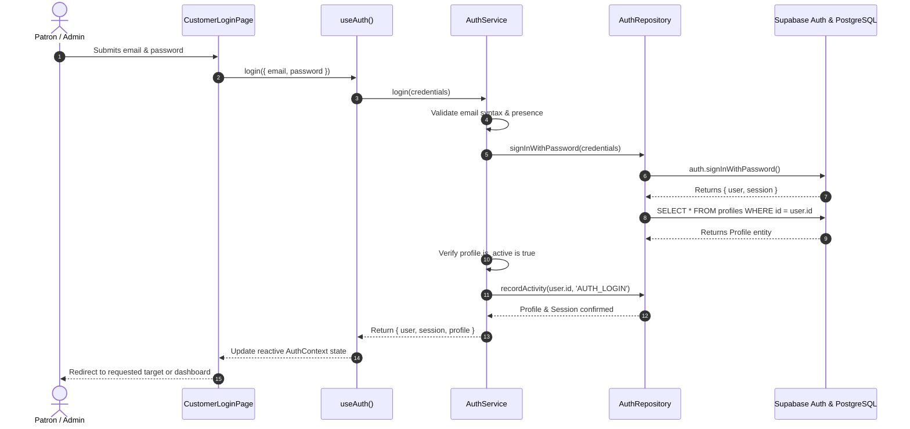

# Client Authentication & Login Flow

## Overview
This document details the multi-tier sequence when a patron or staff member signs into PHILZ SIGNATURE.

---

## 5-Tier Sequence

---

## Error Handling
- **Invalid Credentials**: Returns standard generic message (*"Invalid credentials. Please verify and retry."*) to prevent account enumeration attacks.
- **Deactivated Profile**: Immediately revokes the newly issued session and displays an account notice.
