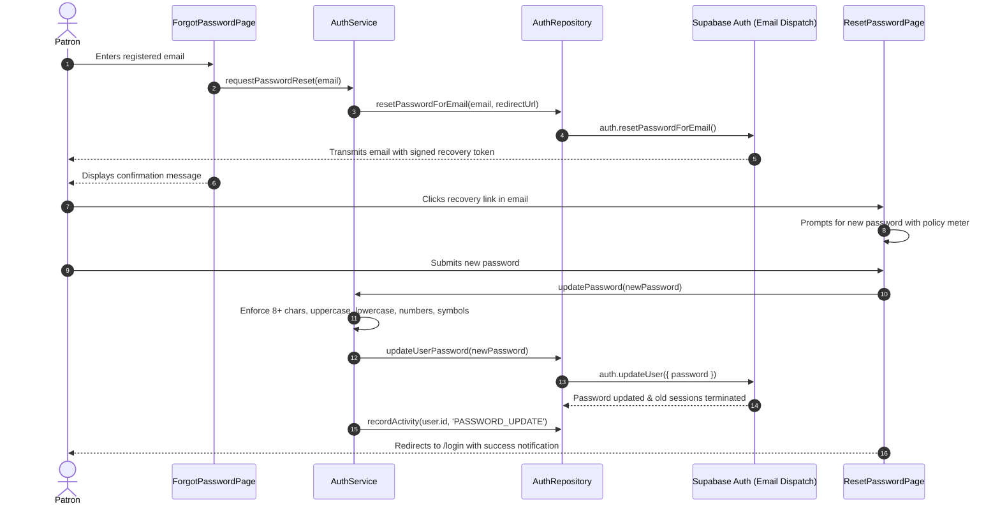

# Account Recovery & Password Reset Flow

## Overview
Password recovery is handled out-of-band via signed, single-use cryptographic recovery links dispatched to the patron's email address.

---

## Process Flow

